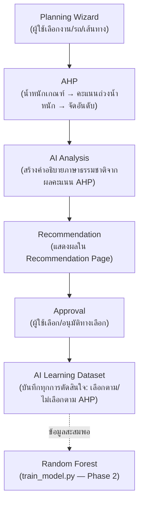

# AI Module — สถาปัตยกรรม

TDSS เป็น **AI-assisted Transportation Decision Support System** — ใช้ AHP
(Analytic Hierarchy Process) เป็นกลไกหลักในการตัดสินใจเหมือนเดิมทุกประการ
โดยมี AI Module เป็น**ส่วนเสริม** (additive layer) ที่วิเคราะห์ผลลัพธ์ของ AHP
และเรียนรู้จากพฤติกรรมการตัดสินใจจริงของผู้ใช้งาน โดยไม่แก้ไข Planning
Wizard, AHP engine, Recommendation Engine เดิม หรือโครงสร้างฐานข้อมูลเดิมแต่อย่างใด

## Pipeline

## องค์ประกอบ

โค้ดทั้งหมดอยู่ใต้ `backend/app/tdss/ai/` แยกจากโค้ด AHP/Recommendation เดิม
(`services/ahp_service.py`, `services/rule_engine.py`, `services/scoring_service.py`,
`services/optimization_service.py`, `services/recommendation_service.py` — ไม่มีการแก้ไขไฟล์เหล่านี้เลย)

| ไฟล์ | หน้าที่ |
|---|---|
| `ai/explainer.py` | **AI Recommendation Analysis** — รับผลลัพธ์ AHP (คะแนนดิบ/น้ำหนัก/อันดับ) มาสร้างคำอธิบาย 4 หัวข้อ: ทำไมเลือกรถคันนี้, ทำไมเลือกเส้นทางนี้, จุดเด่น, ข้อควรระวัง เป็น rule-based (ไม่เรียก LLM ภายนอก — ไม่มีค่าใช้จ่าย/latency/จุดล้มเหลวเพิ่ม) |
| `ai/decision_logger.py` | **AI Learning** — บันทึกทุกครั้งที่มีการอนุมัติแผน (`select_alternative`) ว่าเลือกตรงกับอันดับ 1 ของ AHP หรือไม่, เปลี่ยนรถ/เส้นทางหรือไม่ ลงตาราง `tdss_ai_decision_events` (ตารางใหม่ ไม่กระทบตารางเดิม) |
| `ai/dataset_builder.py` | ประกอบข้อมูลจาก `tdss_ai_decision_events` เป็น (ก) Training Dataset แบบแบน พร้อมใช้กับ scikit-learn และ (ข) สถิติสรุปสำหรับหน้า AI Insights |
| `ai/train_model.py` | สคริปต์ฝึกโมเดล Random Forest (`is_override` เป็น label) — **ไม่ถูกเรียกจาก API** รันแยกด้วยมือเมื่อมีข้อมูลเพียงพอ (`MIN_ROWS_TO_TRAIN = 50`) ระยะแรกที่ข้อมูลยังน้อย สคริปต์จะรายงานว่ายังไม่พอเทรน แต่ Pipeline และ Dataset พร้อมใช้งานแล้ว |

## จุดเชื่อมต่อกับโค้ดเดิม (จำกัดเท่าที่จำเป็น)

มีการแก้ไข `planning_router.py` เพียง 2 จุด ทั้งคู่เป็นการ**เรียกใช้**โมดูล AI ไม่ใช่การแก้ตรรกะการคำนวณ:

1. ใน `_run_out()` (จุดแปลงผลลัพธ์เป็น JSON ตอบกลับ) — เพิ่มการเรียก `generate_ai_analysis()` แล้วแนบผลลัพธ์เป็นฟิลด์ `ai_analysis` เพิ่มเติมใน response เดิม
2. ใน `select_alternative()` (จุดอนุมัติแผน) — เพิ่มการเรียก `log_decision_event()` หนึ่งบรรทัด หลังสร้าง `RecommendationApproval` เพื่อบันทึก event

ไม่มีการแก้ไข: Planning Wizard (frontend), AHP calculation, rule/scoring/optimization services, ตารางเดิมใดๆ

## หน้าจอที่เพิ่ม

- **Recommendation Page** (org workspace) — แสดงผล AI Analysis (การ์ดสีม่วง "🤖 การวิเคราะห์โดย AI") ต่อจากส่วนเหตุผลเดิม
- **ข้อมูลเชิงลึก AI** (org workspace, `/tdss/ai-insights`) — % ที่ Planner เลือกตรงกับ AHP, รถ/เส้นทางที่ถูกเปลี่ยนบ่อยที่สุด, แนวโน้มรายเดือน, ปุ่มส่งออก Dataset (org_admin เท่านั้น)
- **ข้อมูลเชิงลึก AI** (System Owner console, `/tdss/owner/ai-insights`) — ภาพรวมเดียวกันแต่รวมทุกองค์กร

## ตาราง `tdss_ai_decision_events`

ตารางใหม่ (สร้างอัตโนมัติผ่าน `Base.metadata.create_all`, ไม่ต้อง migrate ตารางเดิม) เก็บ 1 แถวต่อการอนุมัติ 1 ครั้ง:
เปรียบเทียบทางเลือกอันดับ 1 ของ AHP กับทางเลือกที่ผู้ใช้เลือกจริง, น้ำหนักเกณฑ์ ณ ขณะนั้น, และค่าดิบของทางเลือกที่เลือก
(ใช้เป็น feature สำหรับเทรนโมเดลในอนาคต)
